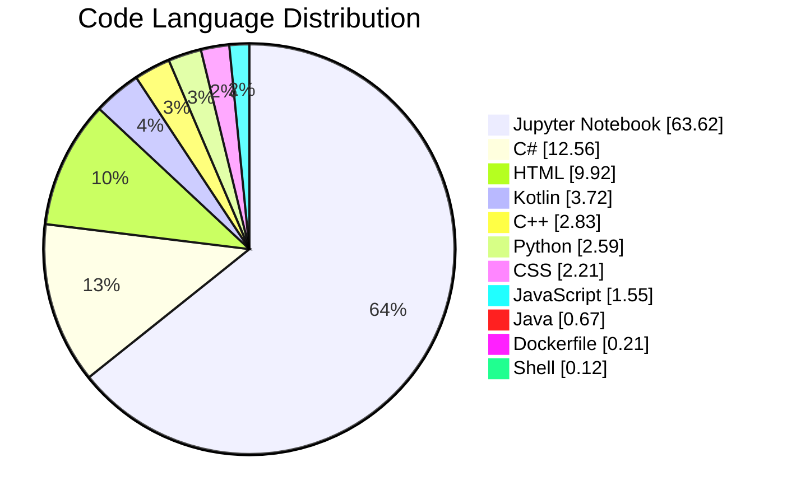

Hi My name is Shahyan Ahmed Kiani
===========================================================================================================================================

The Developer Behind AhmedNextGen 🚀
------------------------------------

I'm a passionate Web Developer and AI Engineer dedicated to building next-generation digital solutions using the latest in Python, AI, and web technologies. Whether it's crafting intuitive front-end interfaces or developing intelligent backend logic, I love solving real-world problems through code.

* 🌍  I'm based in Islamabad
* ✉️  You can contact me at [shahyanahmed598@gmail.com](mailto:shahyanahmed598@gmail.com)
* 🧠  I'm learning AI
* 🤝  I'm open to collaborating on AI projects

## 🌐 Socials:
    

# 💻 Tech Stack:
                            

<!-- language-stats-start -->
## 📊 Language Stats

### 📈 Detailed Breakdown

| Language | Bytes | Percentage |
|----------|-------|------------|
| Jupyter Notebook | 1,401,770 | 63.62% |
| C# | 276,722 | 12.56% |
| HTML | 218,668 | 9.92% |
| Kotlin | 81,979 | 3.72% |
| C++ | 62,442 | 2.83% |
| Python | 56,979 | 2.59% |
| CSS | 48,631 | 2.21% |
| JavaScript | 34,130 | 1.55% |
| Java | 14,722 | 0.67% |
| Dockerfile | 4,520 | 0.21% |
| Shell | 2,683 | 0.12% |

*🔄 Last updated: 2026-05-11 19:27 UTC*
<!-- language-stats-end -->
<!-- Proudly created with GPRM ( https://gprm.itsvg.in ) -->

